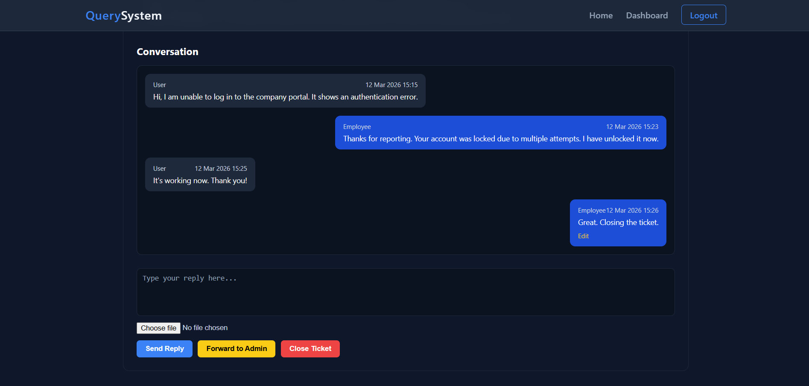
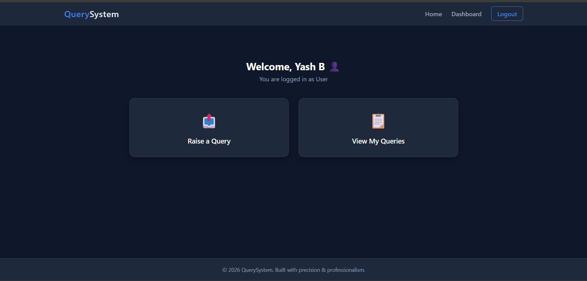
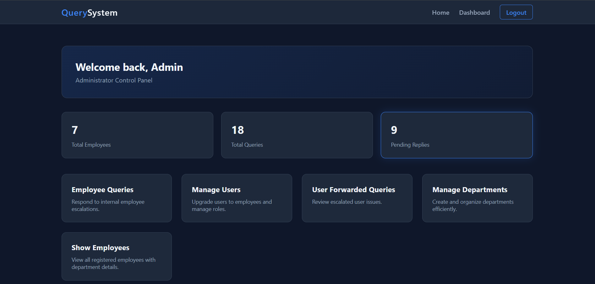
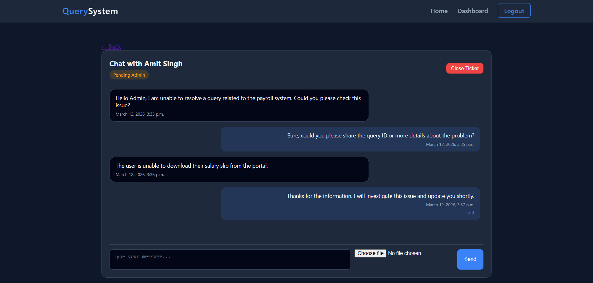

# Query Management System

A role-based ticket conversation system built with Django, MySQL, HTML, and CSS.

Unlike simple question–answer platforms, this system supports multi-message conversations inside a single ticket, allowing structured communication between Users, Employees, and Admins.

The system simulates a real-world customer support workflow where queries move through departments and can escalate to administrators when necessary.

---

# Project Overview

The Query Management System is designed to handle customer queries efficiently using department-based routing and role-based dashboards.

The system consists of three main dashboards:

- 👤 User Dashboard
- 👨‍💼 Employee Dashboard
- 🛠 Admin Dashboard

Each role has its own permissions, workflow, and features.

---

# Tech Stack

## Backend
- Python
- Django

## Database
- MySQL

## Frontend
- HTML
- CSS

## Authentication
- Custom role-based authentication system
- Manual role handling (Django default auth not used)

---

# Core Features

## Role-Based Dashboard System

Each user has a role field in the database:

- user
- employee
- admin

After login, users are automatically redirected to their respective dashboards.

---

# User Features

Users can:

- Create new queries
- Select a department while creating queries
- Send queries directly to admin (optional)
- View their submitted queries
- Participate in conversation threads
- Send unlimited messages inside a ticket
- Continue conversation until the ticket is resolved or closed

This allows a real support-ticket style communication system.

---

# Employee Features

Employees handle queries related to their assigned department.

They can:

- View Unclaimed Queries
- Claim a query
- Reply to users
- Forward queries to admin
- View claimed queries
- View forwarded queries
- View resolved queries
- Create queries for admin
- Participate in multi-message conversations

## Claim Logic

Once an employee claims a query:

- It becomes hidden from other employees
- The claiming employee becomes the primary handler

This prevents multiple employees from working on the same ticket.

---

# Admin Features

Admins have full system-level control.

Admins can:

- View all forwarded queries
- Participate in conversation threads
- Reply directly to user queries
- Close tickets
- View employee queries
- View resolved queries
- View forwarded queries

## Employee Management

Admins can:

- View employee list
- Promote users to employees
- Manage system workflow

---

# Department-Based Routing System

When a user creates a query:

- The user selects a department
- Only employees from that department can see the query
- One employee can claim the ticket
- The ticket disappears from the unclaimed list of other employees

This ensures efficient workload distribution across departments.

---

# Conversation-Based Ticket System

Unlike traditional systems that support only one question and one answer, this platform supports:

- Unlimited messages inside a ticket
- Multiple participants
- Continuous conversation
- Support-style threaded communication

Participants can include:

- User
- Employee
- Admin

The conversation continues until the ticket is resolved or closed.

---

# System Workflow

## User → Employee

- User creates query
- Query appears in department employee dashboard
- One employee claims it
- Conversation begins

## Employee → Admin

- If employee cannot resolve the issue
- The ticket is forwarded to admin
- Admin joins the conversation thread

## User → Admin

Users can also directly send queries to admin.

---

# New Features Added

The system has been further enhanced with additional features:

## Email Notifications

Users and employees receive email notifications for important ticket updates such as:

- New query creation
- Query replies
- Query resolution

---

## File Attachments in Queries

Users can now attach files while creating queries or replying.

This helps in providing:

- screenshots
- documents
- supporting evidence

for better issue resolution.

---

## Dashboard Analytics

Admin dashboard now includes analytics insights, such as:

- Total queries
- Resolved queries
- Department workload
- Query distribution

This helps administrators monitor system performance and support activity.

---

# Database Design Highlights

The system uses structured models such as:

- Custom User model with role field
- Department model
- Query model
- Conversation / Message model

Additional logic includes:

- Claim-based query handling
- Status-based ticket workflow

Example statuses:

- Pending
- Claimed
- Forwarded
- Resolved
- Closed

---

# Project Dashboards

The project includes three separate dashboards:

- User Dashboard
- Employee Dashboard
- Admin Dashboard

Dashboard sections dynamically switch using HTML, CSS and radio-button based UI logic.

---

# Project Screenshots

Add your project screenshots here.

Example structure:


screenshots/
login.png
user_dashboard.png
employee_dashboard.png
admin_dashboard.png
query_conversation.png


## Ticket Conversation



## User Dashboard



## Employee Dashboard


## Admin Dashboard



## One More Ticket Conversation



---

# Unique Selling Points (USP)

✔ Role-based redirection system  
✔ Department-based ticket routing  
✔ Claim-based query management  
✔ Forward-to-admin escalation mechanism  
✔ Multi-message conversation tickets  
✔ Real workflow-based system (not a simple CRUD project)

---

# Future Improvements

Possible future enhancements include:

- Real-time chat using WebSockets
- REST API integration
- JWT authentication
- Mobile-friendly UI

---

# Default Admin Credentials

## Email

admin@test.com


## Password

admin123


---

# How to Run the Project

## Clone the repository

```bash
git clone <your-repo-link>
Go to project directory
cd query-management-system
Install dependencies
pip install -r requirements.txt

Configure MySQL database inside settings.py.

Run migrations
python manage.py migrate
Start the server
python manage.py runserver